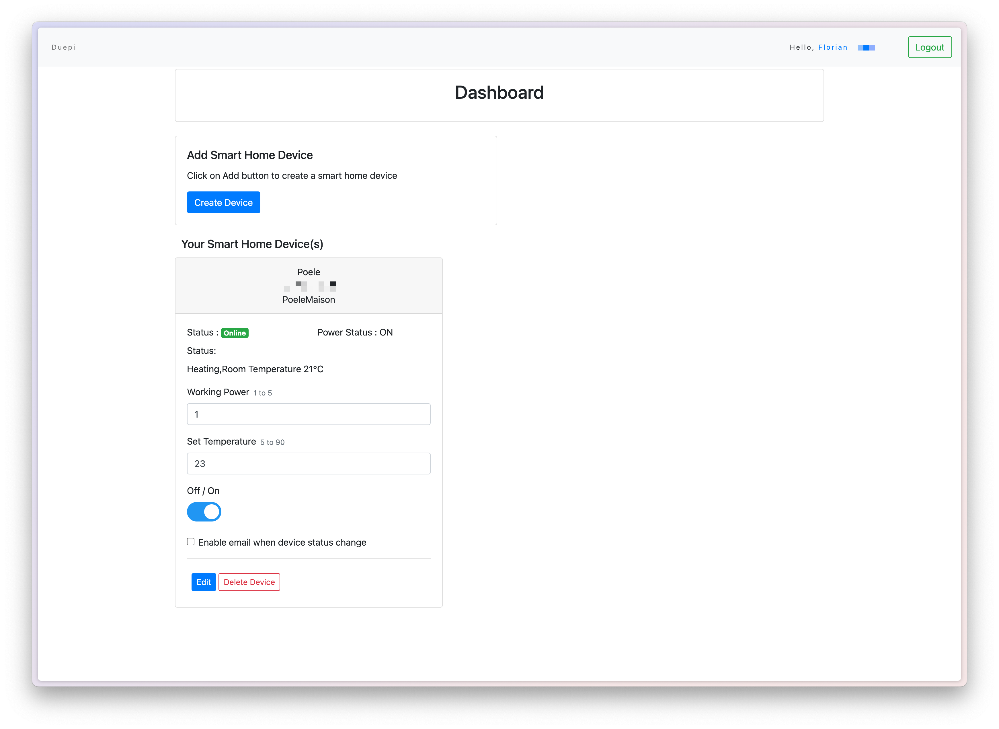
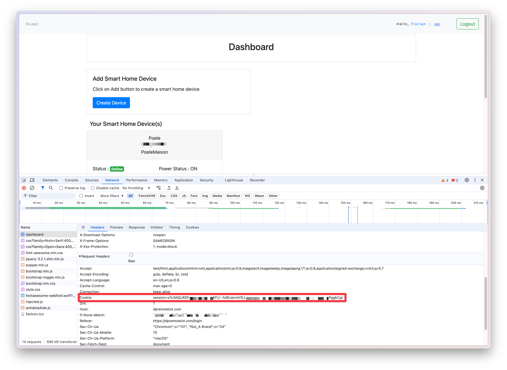

# DuepiRemoteHA

Use a Duepi stove with Home Assistant (HA) and dpremoteiot.com.

## Prerequisites

- A Duepi Remote Wifi module to connect your stove to dpremoteiot.com.
    Ex : https://www.poelediscount.com/modules-wifi-et-thermostats-connectes/3320-module-wifi-duepi-interstoves.html
        https://www.lafrancaisedupoele.fr/accueil/481-module-wi-fi-duepi.html
- An account on dpremoteiot.com with your stove created.



## How to Get Started

### Get Session ID

Use developer tools in your browser to get the session ID.


### Edit `stoveOnOff.py`

Add your personal information in the following lines:
- Line 19: Replace `'ToBeReplace'` with your actual device ID.
- Line 24: Replace `'ToBeReplace'` with your actual session cookie.

### Upload Python Script

Upload your Python script to `/config/scripts`.

### Edit Your `configuration.yaml`

Add the switch and thermostat configurations to your `configuration.yaml` file.

Example:
```yaml
# switch.yaml
command_line: 
  - switch:
      name: StoveOnOff
      command_on: "python3 /config/scripts/stoveOnOff.py On"
      command_off: "python3 /config/scripts/stoveOnOff.py Off"
      command_state: "python3 /config/scripts/stoveStatus.py" # Not used
      value_template: "{{ value != 'Stove Off' }}"

# thermostat.yaml
climate:
  - platform: generic_thermostat
    name: Poele pellets # Name of the thermostat
    heater: switch.stoveonoff # Nodon pilot wire module
    target_sensor: sensor.temperaturesalonsonoff_temperature # Temperature sensor
    min_temp: 15 # Minimum temperature of the thermostat
    max_temp: 25 # Maximum temperature of the thermostat
    target_temp: 22 # Default target temperature
    cold_tolerance: 1.5
    hot_tolerance: 0.5
    min_cycle_duration:
      seconds: 60
    initial_hvac_mode: "heat"
    precision: 0.5


