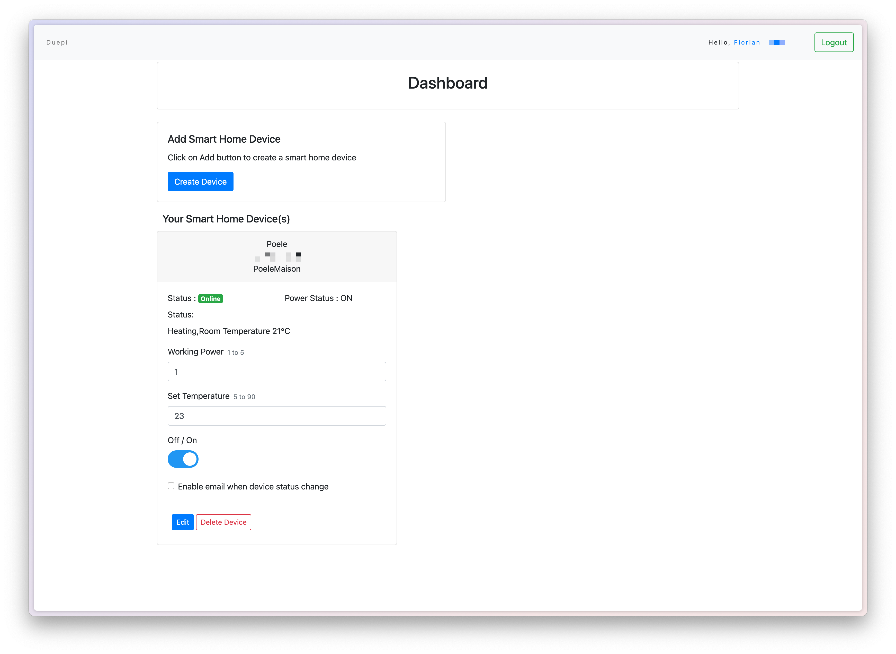
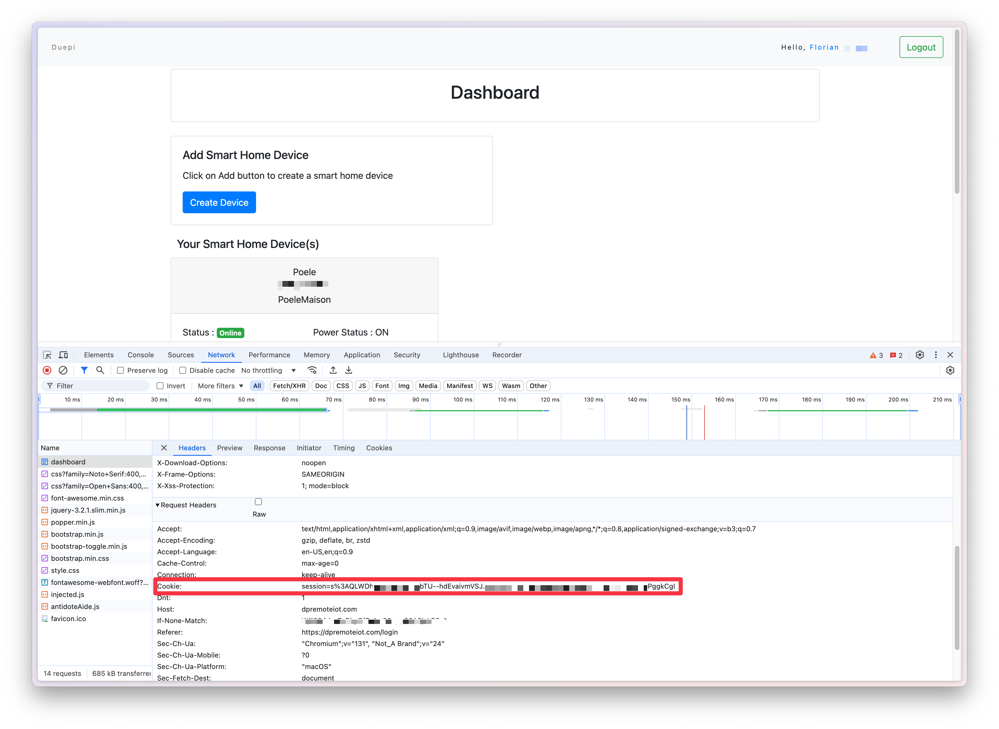

# DuepiRemoteHA
Use a Duepi stove with HA and dpremoteiot.com

# How to

## Create account dpremoteiot.com and get DeviceID

You need to have an account on dpremoteiot.com and created you stove :

## Get Session

