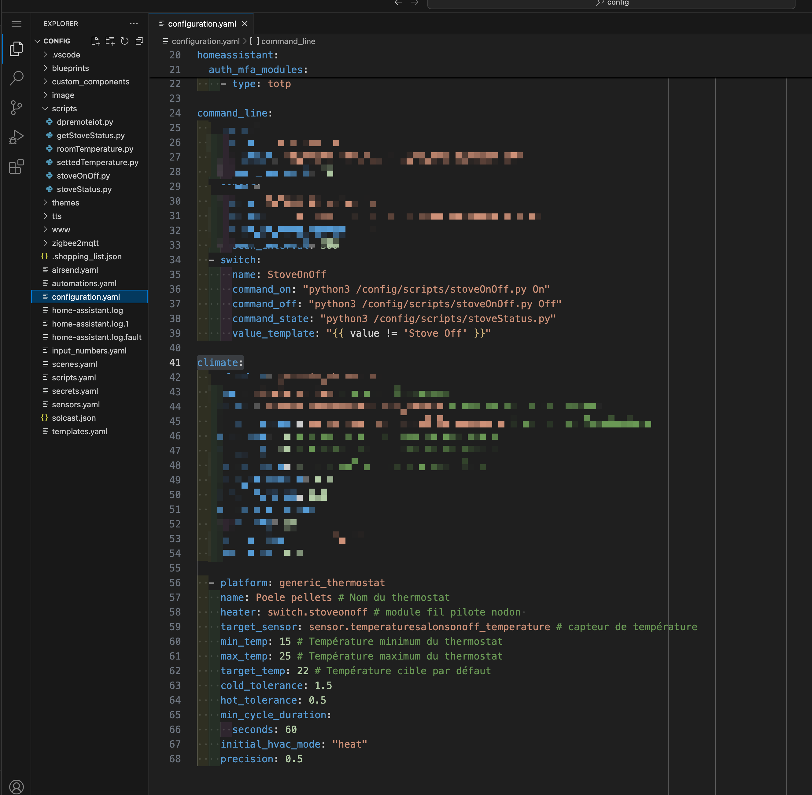

Note : Readme is a workinprogess.

# DuepiRemoteHA
Use a Duepi stove with HA and dpremoteiot.com

## Prerequisites

- Having a Duepi Remote Wifi module to be able to connecte your stove to dpremoteiot.com

# How to

## Get prerequisites

You need to have an account on dpremoteiot.com and created you stove :

Use developper tool to get the session ID.

## Edit stoveOnOff.py
Add your personnal info in line 19 and 24 

## Upload Python script

Upload your python script in /config/scripts

## Edit your configuration.yaml

Add the switch and thermostat in your configuration.yaml

Example:

