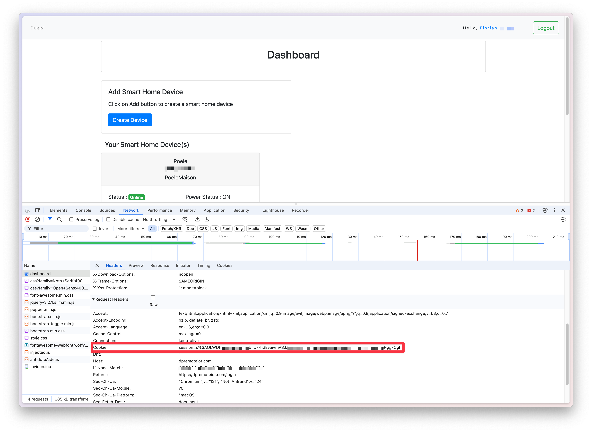

# DuepiRemoteHA

Use a Duepi stove with Home Assistant (HA) and dpremoteiot.com.

## Prerequisites

- A Duepi Remote Wifi module to connect your stove to dpremoteiot.com.
    Ex : https://www.poelediscount.com/modules-wifi-et-thermostats-connectes/3320-module-wifi-duepi-interstoves.html
        https://www.lafrancaisedupoele.fr/accueil/481-module-wi-fi-duepi.html
- An account on dpremoteiot.com with your stove created.


## How to Get Started

### 1. Get Session ID

Use developer tools in your browser to get the session ID.


### 2. Configure credentials

Copy `.env.example` to `.env` next to the script and fill in your values:

```bash
cp .env.example .env
```

Required variables:
- `DUEPI_DEVICE_ID` — your device ID (find it on the dashboard, inspect the "delete device" button)
- `DUEPI_SESSION_COOKIE` — your session cookie (from browser developer tools)

Optional variables:
- `DUEPI_SHORT_ID` — univocal ID (from your app or sticker), used as fallback for status detection
- `DUEPI_SETTED_POWER` — default power level 1-5 (default: `5`)
- `DUEPI_SETTED_TEMPERATURE` — default temperature in °C (default: `25`)
- `DUEPI_LOG_LEVEL` — `DEBUG`, `INFO`, `WARNING`, or `ERROR` (default: `INFO`)

> **Note:** The `.env` file is ignored by git. You can also set these as regular environment variables instead of using a `.env` file.

### 3. Upload Python Script

Upload `stoveOnOff.py` and your `.env` file to `/config/scripts` on your Home Assistant instance.

### 4. Test the script

```bash
# Check status (prints 1 for ON, 0 for OFF)
python3 /config/scripts/stoveOnOff.py status

# Turn on/off
python3 /config/scripts/stoveOnOff.py on
python3 /config/scripts/stoveOnOff.py off

# Enable debug logging for troubleshooting
DUEPI_LOG_LEVEL=DEBUG python3 /config/scripts/stoveOnOff.py status
```

Logs are written to stderr and won't interfere with Home Assistant's stdout capture.

### 5. Edit Your `configuration.yaml`

Add the switch and thermostat configurations to your `configuration.yaml` file.

Example:
```yaml
# switch.yaml
command_line:
  - switch:
      name: StoveOnOff
      command_on: "python3 /config/scripts/stoveOnOff.py on"
      command_off: "python3 /config/scripts/stoveOnOff.py off"
      command_state: "python3 /config/scripts/stoveOnOff.py status"
      value_template: "{{ value == '1' }}"

# thermostat.yaml
climate:
  - platform: generic_thermostat
    name: Poele pellets # Name of the thermostat
    heater: switch.stoveonoff # Nodon pilot wire module
    target_sensor: sensor.temperaturesalonsonoff_temperature # Temperature sensor
    min_temp: 15 # Minimum temperature of the thermostat
    max_temp: 25 # Maximum temperature of the thermostat
    target_temp: 22 # Default target temperature
    cold_tolerance: 1.5
    hot_tolerance: 0.5
    min_cycle_duration:
      seconds: 60
    initial_hvac_mode: "heat"
    precision: 0.5


