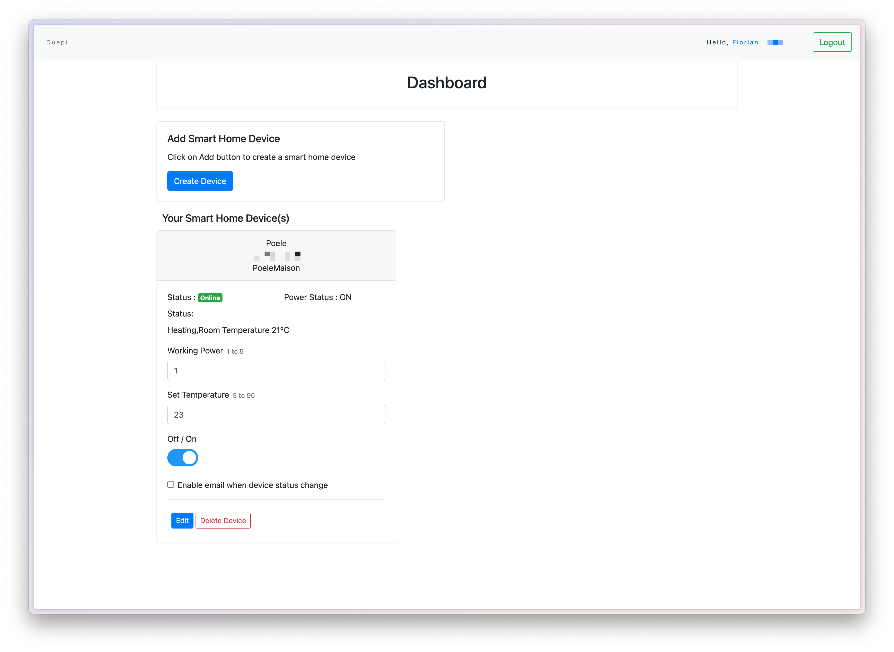

# DuepiRemoteHA

Control a Duepi pellet stove from Home Assistant via the [dpremoteiot.com](https://dpremoteiot.com) cloud API.

## Features

- **Native Climate entity** — full HVAC control with temperature and power level, using the stove's built-in temperature sensor
- **Auto-login** — authenticates with email/password, auto-renews the session when it expires (no more manual cookie extraction!)
- **Config flow UI** — set up entirely from the Home Assistant UI (Settings → Add Integration)
- **Rich entities** — climate, temperature sensor, power level, status text, online/offline connectivity, power slider
- **HACS compatible** — install easily via HACS custom repository
- **Reauth flow** — automatically prompts for new credentials if authentication fails
- **Diagnostics** — built-in diagnostic dump for troubleshooting

## Prerequisites

- A Duepi Remote Wifi module connected to your stove and registered on dpremoteiot.com.
  Examples: [poelediscount.com](https://www.poelediscount.com/modules-wifi-et-thermostats-connectes/3320-module-wifi-duepi-interstoves.html), [lafrancaisedupoele.fr](https://www.lafrancaisedupoele.fr/accueil/481-module-wi-fi-duepi.html)
- An account on [dpremoteiot.com](https://dpremoteiot.com) with your stove added.
- Home Assistant 2024.1.0 or later.



## Installation

### Via HACS (recommended)

[HACS](https://hacs.xyz/) (Home Assistant Community Store) is the easiest way to install custom integrations.

> **Don't have HACS yet?** Follow the [official HACS installation guide](https://hacs.xyz/docs/use/) first.

1. In Home Assistant, go to **HACS → Integrations**.
2. Click the **⋮** (3-dot menu) in the top-right corner → **Custom repositories**.
3. In the dialog that opens:
   - **Repository:** `https://github.com/FlorianCasse/DuepiRemoteHA`
   - **Category:** select **Integration**
   - Click **Add**.
4. Close the dialog. Search for **Duepi Pellet Stove** in the HACS integration list.
5. Click **Download** and confirm.
6. **Restart Home Assistant** (Settings → System → Restart).

### Manual installation

Use this method if you don't want to use HACS.

1. Download or clone this repository.
2. Copy the entire `custom_components/duepi/` folder into your Home Assistant configuration directory:
   ```
   <your HA config>/
   └── custom_components/
       └── duepi/
           ├── __init__.py
           ├── manifest.json
           ├── api.py
           ├── climate.py
           ├── ...
   ```
   > **Tip:** The HA config directory is typically `/config/` if you use Home Assistant OS/Supervised, or `~/.homeassistant/` for Core installations.
3. **Restart Home Assistant** (Settings → System → Restart).

## Setup

Once the integration is installed and HA has restarted:

### Step 1 — Find your Device ID

Before adding the integration, you need your **Device ID** from dpremoteiot.com:

1. Log in to [dpremoteiot.com](https://dpremoteiot.com).
2. On the dashboard, find your stove and look for the **delete device** button.
3. Inspect the button's link — it contains `deviceid=YOUR_DEVICE_ID`.


### Step 2 — Add the integration

1. Go to **Settings → Devices & Services**.
2. Click **+ Add Integration** (bottom-right).
3. Search for **Duepi Pellet Stove** and select it.
4. Fill in the form:

| Field | Description |
|---|---|
| **Email** | Your dpremoteiot.com account email |
| **Password** | Your dpremoteiot.com account password |
| **Device ID** | The device ID you found in Step 1 |

5. Click **Submit**. The integration will validate your credentials by logging in to dpremoteiot.com.
6. If successful, a new **Duepi Pellet Stove** device appears with all its entities.

> **Authentication failed?** Double-check your email and password. Make sure you can log in to [dpremoteiot.com](https://dpremoteiot.com) with the same credentials in a browser.

### Step 3 — Configure options (optional)

1. Go to **Settings → Devices & Services → Duepi Pellet Stove**.
2. Click **Configure**.

| Option | Default | Description |
|---|---|---|
| Update interval | 120s | How often to poll the stove state (min: 30s) |
| Default power | 5 | Power level used when turning on (1-5) |
| Default temperature | 25°C | Temperature used when turning on (0-35°C) |

## Entities

All entities are grouped under a single **Duepi Pellet Stove** device:

| Entity | Type | Description |
|---|---|---|
| Duepi Pellet Stove | Climate | Main control — HVAC mode (heat/off), target temperature, fan mode (power 1-5) |
| Room temperature | Sensor | Current room temperature from the stove's built-in sensor (°C) |
| Power level | Sensor | Current working power level (1-5) |
| Status | Sensor | Status text (Heating, Idle, Standby, Off...) |
| Set temperature | Sensor | Current target temperature (°C) |
| Online | Binary sensor | Whether the stove is reachable via dpremoteiot.com |
| Power level | Number | Slider to adjust power level (1-5) |

## Migration from Script-Based Setup

If you were using the previous `stoveOnOff.py` + `command_line` setup, an interactive migration script is provided to guide you through the process.

### Migration script

The script can run **locally on your HA instance** or **remotely from your computer via SSH**.

#### Local execution

If you have direct access to the HA terminal (SSH add-on, console, etc.):

```bash
python3 /config/scripts/migrate.py
```

#### Remote execution via SSH

Run the script from your computer — it connects to HA via SSH and performs all operations remotely:

```bash
# Basic usage (default SSH port 22):
python3 migrate.py --ssh root@homeassistant

# With a custom SSH port (e.g. Home Assistant OS uses port 22222):
python3 migrate.py --ssh root@192.168.1.100 --port 22222

# With a specific SSH key:
python3 migrate.py --ssh root@homeassistant --key ~/.ssh/ha_key

# Non-interactive mode (auto-confirm backup/removal, useful for scripting):
python3 migrate.py --ssh root@homeassistant --no-interactive

# Custom HA config directory (default is /config):
python3 migrate.py --ssh root@homeassistant --config /home/homeassistant/.homeassistant
```

#### Script options

| Option | Default | Description |
|---|---|---|
| `--ssh USER@HOST` | *(local)* | SSH destination for remote execution |
| `--port PORT` | `22` | SSH port (HA OS typically uses `22222`) |
| `--key PATH` | *(none)* | Path to SSH private key file |
| `--config PATH` | `/config` | HA config directory on the target machine |
| `--no-interactive` | *(off)* | Skip confirmation prompts (auto-yes) |

#### What the script does

1. **Detects** the old installation (`stoveOnOff.py` and `.env` in `/config/scripts/`)
2. **Reads** your old `.env` to extract the Device ID and default settings
3. **Scans** `configuration.yaml` for `command_line` and `generic_thermostat` entries to remove
4. **Checks** if the new `custom_components/duepi` integration is already installed
5. **Backs up** old files to `/config/duepi_migration_backup/` then removes them
6. **Prints** step-by-step instructions to finish the migration in the HA UI

#### Example output

```
============================================================
  Duepi Pellet Stove — Migration Script
============================================================
  Mode: SSH remote → root@192.168.1.100
  HA config: /config

[Step 1] Detecting old installation
  ✓ Found old script: /config/scripts/stoveOnOff.py
  ✓ Found old .env: /config/scripts/.env

[Step 2] Reading old credentials
  ✓ Device ID: a1b2c3d4e5f6...
  ✓ Session cookie found (will NOT be migrated — new integration uses email/password)
  ✓ Default power: 5
  ✓ Default temperature: 25°C

[Step 3] Scanning configuration.yaml for old entries
  ⚠ Found command_line references to stoveOnOff.py:
      command_on: "python3 /config/scripts/stoveOnOff.py on"
      command_off: "python3 /config/scripts/stoveOnOff.py off"
      command_state: "python3 /config/scripts/stoveOnOff.py status"
  ✓ No generic_thermostat stove entries found

[Step 4] Checking new custom integration
  ✓ New integration already installed at custom_components/duepi/

[Step 5] Backup and cleanup
  ✓ Backed up: /config/scripts/stoveOnOff.py → /config/duepi_migration_backup/
  ✓ Backed up: /config/scripts/.env → /config/duepi_migration_backup/
  ✓ Removed: /config/scripts/stoveOnOff.py
  ✓ Removed: /config/scripts/.env

[Step 6] Next steps
  ...
```

### Manual migration

If you prefer to migrate manually without the script:

1. Install the custom integration (see [Installation](#installation)).
2. Remove from your `configuration.yaml`:
   - The `command_line` switch and sensor entries referencing `stoveOnOff.py`
   - The `generic_thermostat` climate entry (if used)
3. Restart Home Assistant.
4. Add the integration via the UI with your dpremoteiot.com **email and password**.
5. Delete `/config/scripts/stoveOnOff.py` and `/config/scripts/.env`.
6. Update any automations using the entity mapping below.

### Entity mapping (old → new)

| Old entity | New entity |
|---|---|
| `switch.pellet_stove` | `climate.duepi_pellet_stove` |
| `sensor.pellet_stove_info` (room_temperature) | `sensor.duepi_pellet_stove_room_temperature` |
| `sensor.pellet_stove_info` (working_power) | `sensor.duepi_pellet_stove_power_level` |
| `sensor.pellet_stove_info` (status_text) | `sensor.duepi_pellet_stove_status` |
| `sensor.pellet_stove_info` (online) | `binary_sensor.duepi_pellet_stove_online` |

The old script files are preserved in the `legacy/` folder of this repository for reference.

## Known Limitations

- **Power level may be ignored** — some users report that dpremoteiot.com always starts the stove at power 3 regardless of `settedPower`. This is a server-side limitation, not a bug in this integration.
- **Cloud dependency** — requires internet connectivity (communicates via dpremoteiot.com, not locally).
- **HTML scraping** — state detection relies on parsing the dashboard HTML. If dpremoteiot.com changes their layout, the integration may need updating.
